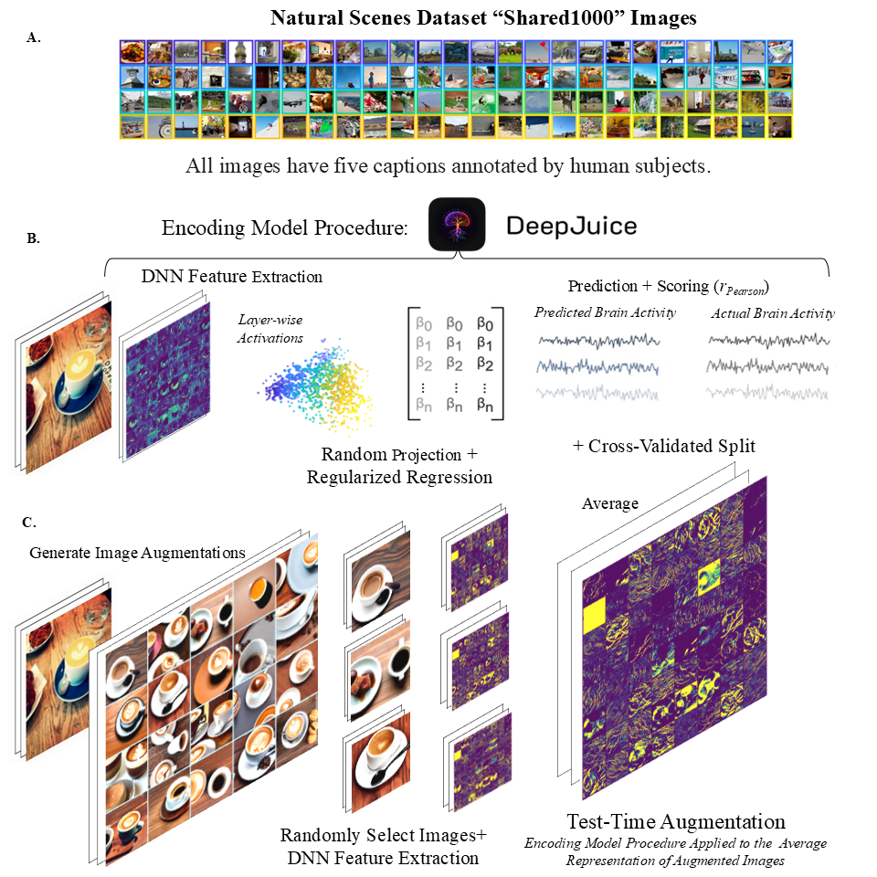

# Test-Time Augmentation for Model-Brain Similarity
---

This repository is for [Neural networks and brains share the gist but not the details: a surprising benefit of image ensembles for encoding models of visual cortex](https://openreview.net/forum?id=DtEeVWfgNM&noteId=DtEeVWfgNM).

## Repository Structure

The repository includes two parts:
1. A demo explains the pipeline how Test-Time Augmentation (TTA) could improve model-brain similarity. This demo only requires some minimal and common packages to run so that users could an easy path to understand the essential ideas of our work;
2. An implementation with information could help reproduce all experiments, which would require two external packages called bonner-libarary [package link](https://github.com/BonnerLab/bonner-libraries) and Deepjuice (You could contact with Colin Conwell for more information). This part is still under development.

The detailed outline for the repository would be:
```
TTA/
├── data/                  # Raw and processed data
├── demo/                  # Demo codes
│   └── demo_data          # Data for demo
│   └── demo.ipynb         # Jupyter notebook for demo
├── docs/                  # Figures, poster and slides
├── notebooks/             # Jupyter notebooks for exploration and analysis
├── results/               # Output files, figures, logs
├── scripts/               # Essential functions
├── src/                   # Source code (main logic, modules, etc.)
│   └── lib                # Helper functions
├── environment.yml        # Conda environment
└── pyproject.toml         # Package manager
├── README.md              # Project overview
└── requirements.txt       # Dependencies
```

## Getting Statred with Demo

It is recommended to use environment files to manage your project dependencies. However, if you only need a quick start or a basic understanding, you should be able to run demo/demo.ipynb in a standard Python environment with commonly used packages:

```
pip install torch pandas
```

## Getting Started With Implemantations

We have utilized two separate conda environment to manage this project.

(1) For the purpose of handling neural dataset such as Natural Scence Dataset and syntheizing images through generative models, you can create a conda environment called environment_name_1 by using the command below.Feel free to change the environment name if you want. The original name used for this project is called diffuse-encoder.
```
conda env create -n environment_name_1 -f environment.yml
```
Then, if there are any updates about the project, you can git pull the project and update the environment with the following line.
```
conda env update -n environment_name_1 -f environment.yml
```
Notice: functions in this conda environment is largely built on a package called [bonner-libarary](https://github.com/BonnerLab/bonner-libraries). Therefore, you might need to read information for this package if you have met some expected issues, which can be attributed to this package.

(2) For the purpose of handling neural networks, aligning representation between two systems and general visulization, we use a powerful toolbox called DeepJuice(the latest branch). You could contact with Colin Conwell for more information and set another conda environment for DeepJuice. If you only want to reproduce the result and plot based on .csv files in the provided results folder, to set an exact conda environment is not required. Notice: the plotting code still relies on some functions from DeepJuice. However, it's expected to be easily reproduced for everyone when this repo get published. We can call it environment_name_2.

### Notebooks to help you understand how diffusion model can manipulate images in different way.

Feel free to walk through /notebook/tutorial_with_diffusion.ipynb. You have a taste on how we manipulate images for the project. However, the development of diffusion is moving so fast. You could check many useful resources to know more advanced methods you could have a try.

### A quick walkthrough for essential functions

When you get this Git repo in your machine and you have set the conda environment ready, you can quickly run the following code for getting essential functoions when you are at the directory of this project

For a quick demonstration for you can synthesize images for this project,
```
conda activate environment_name_1
python /script/diffuse_encoder_env/synthesize_images_diffusers.py --experiment 2  --output test --NSD_shared Sample
```
This code will quickly syntheize several image variations based on the first 5 NSD Stimuli ranked by their COCO Id in a folder called test. In default, images are generated by stable diffusion v1-5. If you want to try other diffusion models, please read through diffuser packages.

If you want to create a sample directory for 1000 images for further demonstration on the encoding procedure.
```
conda activate environment_name_1
python /script/diffuse_encoder_env/synthesize_images_diffusers.py --experiment 2  --output test --NSD_shared Full --strength 1 --guidance-scale 7.5
```
This code will quickly syntheize several image variations based on the NSD shard 1000 images only by text information( image weight = 1 - strength. If guidance_scale < 1, the text information won't be taken account of).

Do the encoding procedure
```
conda activate environment_name_2
python script/deepjuice_env/model_brain/encoding_function.py
```
In default, it will calculate the encoding score of Alexnet for original images and save the /result/benchmark. You can have a more detailed control on it by setting another image path which is either a folder of 1000 images whose names are f'{COCO_Id}'.jpg. Or it can be folder which consist 1000 folder named by COCO ID with contain images in the form image_1.jpg, image_2.jpg,.., and so on. The code above would automatically set the folder in this way.

## Citations
The bibtex for [the paper](https://openreview.net/forum?id=DtEeVWfgNM&noteId=DtEeVWfgNM) would be provided soon.

## Contact
1. For bonner-libarary [bonner-libarary](https://github.com/BonnerLab/bonner-libraries), you might need to read information for this package if you have met some expected;
2. For DeepJuice, you could contact Colin Conwell;
3. For any inquiries, you could contact Yingqi Rong (yrong12@jh.edu) or raise an issue.